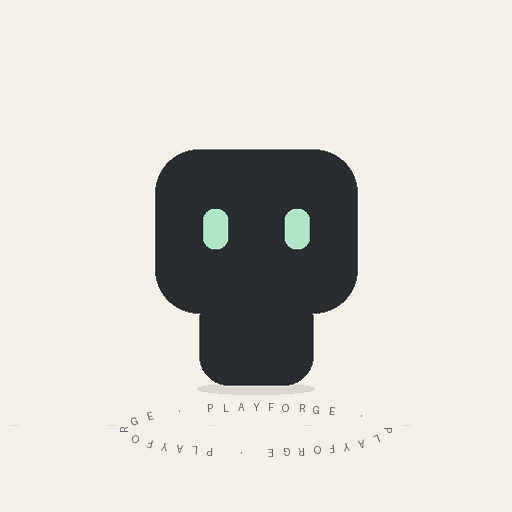

# 灵动造物 · 新运行的 GIF 演示

这是 `make_demo.py` 生成的原创几何测试角色，随后由随附渲染器生成 GIF；用于验证分层动画管线。不是教程中历史十款成品，也不代表已完成十种静态风格设计。

## 本次实测

2026-09-16，Python 3 + Pillow 11.3.0：512×512、400 帧、399 个不同帧、每帧 20ms、总长 8000ms、平均 50fps、无限循环。文件完整逐帧解码；[完整校验报告](validation.json) 包含大小、SHA256 与首尾差值。

## 检视范围

查看第 0、28、32、37、50、70、100、200、300、399 帧的关键帧拼图：可见眼睛从开启到闭合再开启，头部轻微旋转，角色升降，文字固定且没有额外手脚。[关键帧拼图](contact-sheet.png)

未完成实时播放观察；首尾平均像素差约 3.01，不能以此证明完美无缝。这个示例不验证步行接地或多足爬行；基础脚摆角未实现世界坐标足底锁定。环形微小文字使用运行环境可用字体，字体回退与缩小显示会影响可读性，品牌正式成品应另行校对。

## 复现

在 Skill 根目录，安装 requirements.txt 后执行 README 中三个命令。默认 rig、图层和参数由 `make_demo.py` 生成，无需外部图片；它只证明工具可以运行，生产角色需要自己的分层。

来源教程中的历史十款 GIF 未随文件提供，未在本次重复检验。测试还确认缺失脚层、非整数帧延时、不是 10ms 整数倍的帧延时、非法周期和空角色等六种无效配置会报错。
